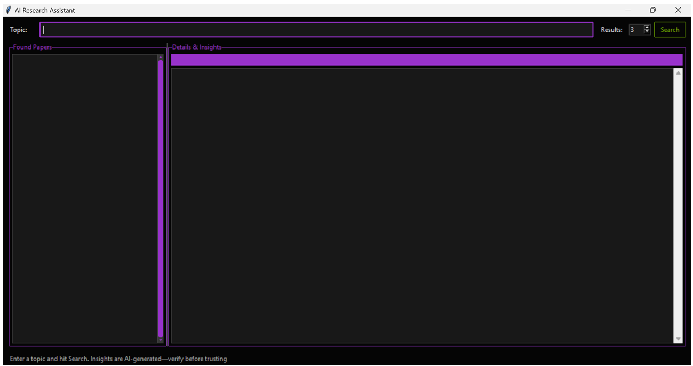
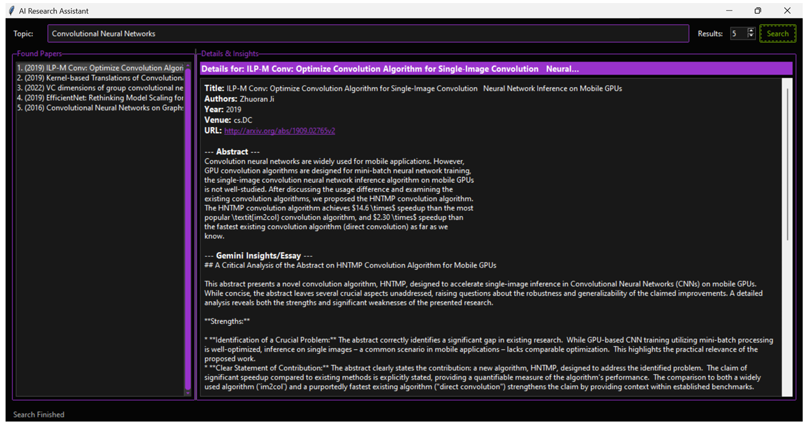
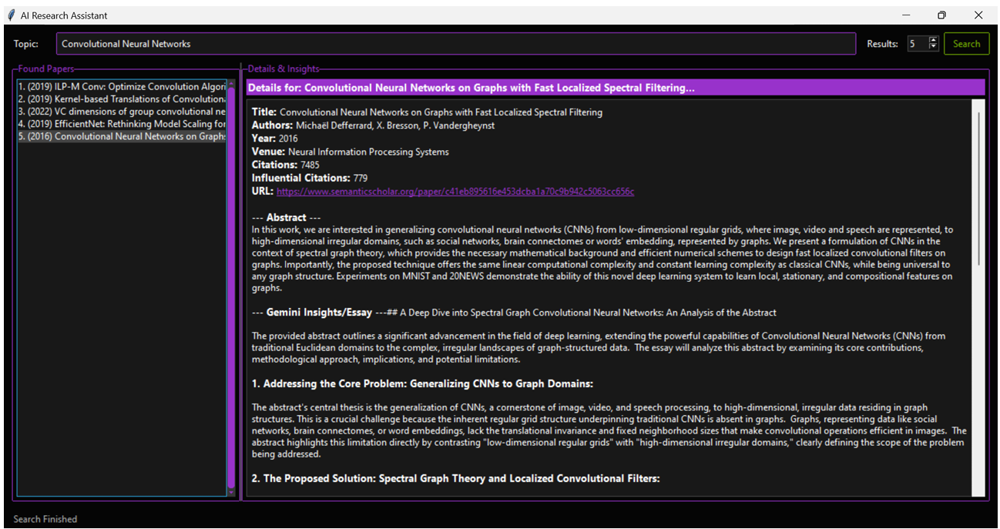
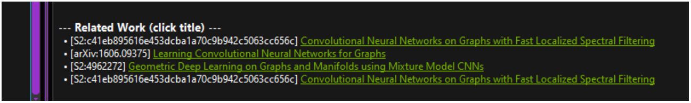
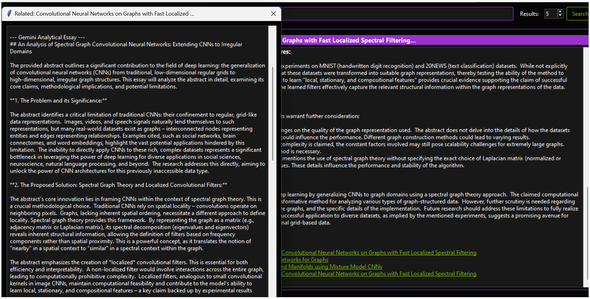

# AI Research Assistant

The AI Research Assistant is a desktop application designed to help users search for and analyze academic papers from arXiv and Semantic Scholar. It uses Google's Gemini AI to provide detailed analyses and find related research, streamlining the literature review process.

## Features

* **Search multiple databases:** Find papers from arXiv and Semantic Scholar simultaneously.
* **AI-powered analysis:** Get in-depth analytical essays on paper abstracts, generated by the Gemini AI model.
* **Discover related work:** Automatically find and display research papers related to the selected article.
* **User-friendly interface:** A clean and intuitive graphical user interface built with tkinter.
* **View paper details:** See a paper's title, authors, year of publication, venue, abstract, and more.
* **Direct-linking to source:** Open the paper's URL in your web browser with a single click.

## User Interface Overview

Here are some screenshots showcasing the application's user interface and key functionalities:

### Initial Application State

This image shows the AI Research Assistant upon launch, displaying the search bar, results limit, and initial instructions.
<div align="center">
    
    <br>
    <em>Figure 1: The application's initial state, ready for a search query.</em>
</div>
<br>

### Search Results and Paper Details (arXiv Example)

After entering a research topic (e.g., "Convolutional Neural Networks") and performing a search, the application displays a list of found papers on the left. Clicking on a paper reveals its details, abstract, AI-generated insights, and related work on the right. This example shows details for an arXiv paper.
<div align="center">
    
    <br>
    <em>Figure 2: Search results with detailed information and AI insights for an arXiv paper.</em>
</div>
<br>

### Search Results and Paper Details (Semantic Scholar Example)

This screenshot demonstrates another search result, this time highlighting a paper fetched from Semantic Scholar, along with its details and the AI's analytical essay.
<div align="center">
    
    <br>
    <em>Figure 3: Detailed view of a Semantic Scholar paper with AI analysis.</em>
</div>
<br>

### Related Work Feature

When viewing a paper's details, the "Related Work" section provides clickable links to other relevant research. This allows users to easily navigate and explore interconnected academic literature.
<div align="center">
    
    <br>
    <em>Figure 4: The "Related Work" section displaying clickable titles of relevant papers.</em>
</div>
<br>

### New Window for Related Papers

Clicking on a related paper's title opens its abstract and analytical essay in a new, separate window, facilitating comparison and deeper exploration without losing context of the primary search.
<div align="center">
    
    <br>
    <em>Figure 5: A new window showing details and AI analysis for a related paper.</em>
</div>
<br>

---

## How It Works

The application consists of a backend that handles communication with external APIs and a frontend for user interaction.

* **Backend (`backend.py`):**
    * Queries the arXiv API and the Semantic Scholar API to search for papers.
    * Uses the Google Gemini model to generate analytical essays and find related papers based on a paper's abstract.
    * Handles API key management for Google and Semantic Scholar.

* **Frontend (`gui.py`):**
    * Provides a graphical user interface using tkinter.
    * Allows users to enter a search query and view a list of resulting papers.
    * Displays detailed information for each paper, including the AI-generated analysis.
    * Enables users to click through to related papers, opening them in new windows for comparison.

## Setup and Installation

1.  **Clone the repository:**
    ```bash
    git clone [https://github.com/T-9173/researchassistant.git](https://github.com/T-9173/researchassistant.git)
    cd researchassistant
    ```
2.  **Install dependencies:**
    The application requires Python 3 and the following libraries: `requests`, `feedparser`, `google-generativeai`, `ttkbootstrap`.
    ```bash
    pip install requests feedparser google-generativeai ttkbootstrap
    ```
3.  **Set up API Keys:**
    You will need API keys from Google and Semantic Scholar.
    * **Google API Key:** Create an environment variable named `GOOGLE_API_KEY` with your key.
    * **Semantic Scholar API Key:** Create an environment variable named `SEMANTIC_API` with your key.

## Usage

Run the `gui.py` file to start the application:
```bash
python gui.py
